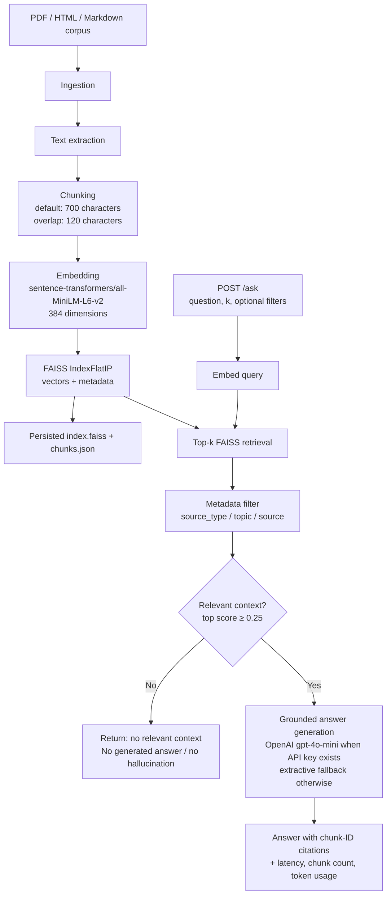
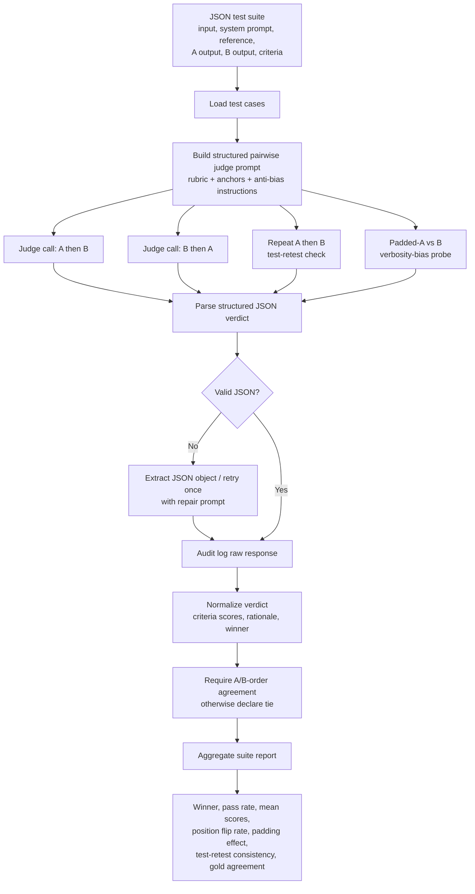

# GenAI-Assignment

#Problem-2

```mermaid
flowchart TD
    A["PDF / HTML / Markdown corpus"] --> B["Ingestion"]
    B --> C["Text extraction"]
    C --> D["Chunking<br/>default: 700 characters<br/>overlap: 120 characters"]
    D --> E["Embedding<br/>sentence-transformers/all-MiniLM-L6-v2<br/>384 dimensions"]
    E --> F["FAISS IndexFlatIP<br/>vectors + metadata"]
    F --> G["Persisted index.faiss + chunks.json"]

    H["POST /ask<br/>question, k, optional filters"] --> I["Embed query"]
    I --> J["Top-k FAISS retrieval"]
    J --> K["Metadata filter<br/>source_type / topic / source"]
    K --> L{"Relevant context?<br/>top score ≥ 0.25"}
    L -->|No| M["Return: no relevant context<br/>No generated answer / no hallucination"]
    L -->|Yes| N["Grounded answer generation<br/>OpenAI gpt-4o-mini when API key exists<br/>extractive fallback otherwise"]
    N --> O["Answer with chunk-ID citations<br/>+ latency, chunk count, token usage"]
    F --> J
```

#Problem-2

```mermaid
flowchart TD
    A["JSON test suite<br/>input, system prompt, reference,<br/>A output, B output, criteria"] --> B["Load test cases"]
    B --> C["Build structured pairwise judge prompt<br/>rubric + anchors + anti-bias instructions"]
    C --> D["Judge call: A then B"]
    C --> E["Judge call: B then A"]
    C --> F["Repeat A then B<br/>test-retest check"]
    C --> G["Padded-A vs B<br/>verbosity-bias probe"]

    D --> H["Parse structured JSON verdict"]
    E --> H
    F --> H
    G --> H

    H --> I{"Valid JSON?"}
    I -->|No| J["Extract JSON object / retry once<br/>with repair prompt"]
    J --> K["Audit log raw response"]
    I -->|Yes| K

    K --> L["Normalize verdict<br/>criteria scores, rationale, winner"]
    L --> M["Require A/B-order agreement<br/>otherwise declare tie"]
    M --> N["Aggregate suite report"]
    N --> O["Winner, pass rate, mean scores,<br/>position flip rate, padding effect,<br/>test-retest consistency, gold agreement"]
```
