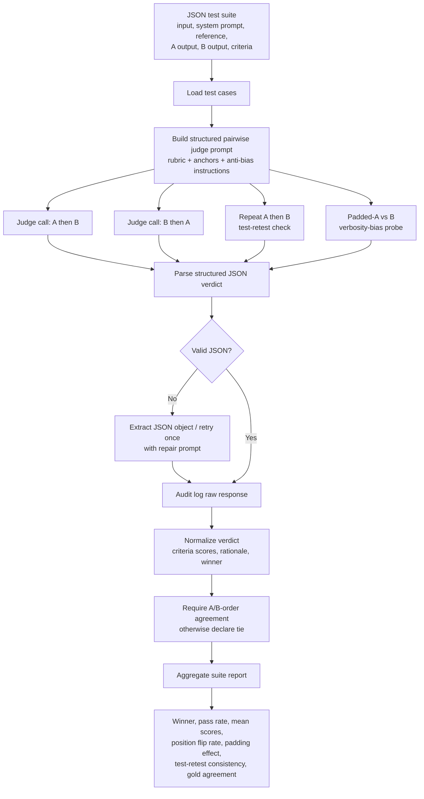

# GenAI-Assignment

```mermaid
flowchart TD
    A["JSON test suite<br/>input, system prompt, reference,<br/>A output, B output, criteria"] --> B["Load test cases"]
    B --> C["Build structured pairwise judge prompt<br/>rubric + anchors + anti-bias instructions"]
    C --> D["Judge call: A then B"]
    C --> E["Judge call: B then A"]
    C --> F["Repeat A then B<br/>test-retest check"]
    C --> G["Padded-A vs B<br/>verbosity-bias probe"]

    D --> H["Parse structured JSON verdict"]
    E --> H
    F --> H
    G --> H

    H --> I{"Valid JSON?"}
    I -->|No| J["Extract JSON object / retry once<br/>with repair prompt"]
    J --> K["Audit log raw response"]
    I -->|Yes| K

    K --> L["Normalize verdict<br/>criteria scores, rationale, winner"]
    L --> M["Require A/B-order agreement<br/>otherwise declare tie"]
    M --> N["Aggregate suite report"]
    N --> O["Winner, pass rate, mean scores,<br/>position flip rate, padding effect,<br/>test-retest consistency, gold agreement"]
```
